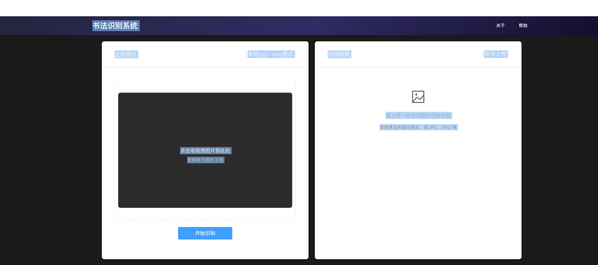

<center>
    
    <br>
    <div style="color:orange; border-bottom: 1px solid #d9d9d9;
    display: inline-block;
    color: #999;
    padding: 2px;">Digital Strategy Research</div>
</center>

<br>
机器学习 / 深度学习 / 人工智能速报，长期不定时更新


# 书法家风格识别系统

这是一个基于深度学习的书法家风格识别系统，可以识别不同书法家的书写风格。



## 主要功能

- 书法图片风格识别
- 支持20位书法家的风格识别
- RESTful API接口提供预测服务

## 支持的书法家

系统可以识别以下20位书法家的风格：

- 柳青松(lqs)
- 黄庭坚(htj)
- 王羲之(wzm)
- 冯文潜(fwq)
- 颜真卿(yzq)
- 怀素(hy)
- 米芾(mf)
- 孙过庭(sgt)
- 苏孟恒(smh)
- 欧阳询(oyx)
- 柳溪(lx)
- 王献之(wxz)
- 赵孟頫(zmf)
- 杨月润(yyr)
- 米芾(mzd)
- 八大山人(bdsr)
- 蔡襄(csl)
- 高俊(gj)
- 沈尹默(shz)
- 李光启(lgq)

## 依赖环境

- Python 3.x
- PyTorch
- Flask
- Pillow
- torchvision

## 项目结构

```
shufa/
├── api.py          # API服务主程序
├── model.py        # 模型定义
├── data.py         # 数据处理
├── train.py        # 训练脚本
├── evaluate.py     # 评估脚本
├── predict.py      # 预测脚本
├── dist/           # 打包后的可执行文件
└── workdir/        # 模型文件存储目录
```

## 使用方式

### 启动服务

```bash
./dist/api --model-path ../workdir/best_model.pth
```

服务默认运行在 `8080` 端口。

### API 接口

#### 预测接口

- URL: `/predict`
- 方法: POST
- Content-Type: multipart/form-data
- 参数:
  - file: 图片文件

示例请求：

```bash
curl -X POST -F "file=@image.jpg" http://localhost:8080/predict
```

响应格式：

```json
{
    "calligrapher": "书法家名字",
    "confidence": 0.95
}
```

## 注意事项

1. 确保模型文件路径正确
2. 输入图片应为清晰的书法作品图片
3. 服务启动后会占用8080端口，请确保该端口未被占用

## 示例模型
```bash
https://pan.baidu.com/s/1d7YelHdPetXhoOZFZUEZMA?pwd=cdsr
```

## 示例数据集
```bash
https://pan.baidu.com/s/1upFxJrX1FYWQJN0WytDZMw?pwd=cdsr
```

## 许可证

MIT
